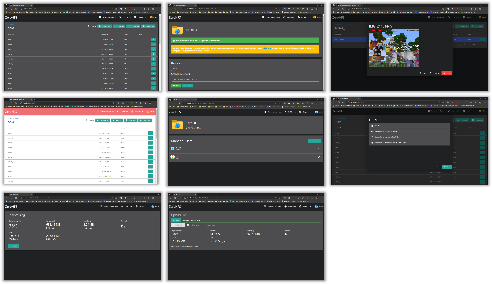

# ZeroHFS
a HTTP file server that based on Python3 and Flask

## **Warning!!!**
1. ZeroHFS is **still under development**, if you encounter a bug, please submit an issue!  
2. ZeroHFS will be updated from time to time, if you want to update, please refer to [Update ZeroHFS](#Update) block

## Features
 - Pretty web UI
 - Easy manage server in webbrowser
 - Easy to setting folder permission in webbrowser
 - Folder upload supported
 - SSL Supported
 - CSRF Protect
 - Dedicated App for Android (Currently still in development!)  

## Screenshots

## Installation Guide
1. Clone this repository first  
`git clone https://github.com/cp59/ZeroHFS.git`  
   
2. Install Requirement module  
`pip install -r requirements.txt`  
   
3. And start ZeroHFS server  
`python3 app.py`
 
## Update
ZeroHFS will be updated from time to time, if you want to update, please refer to the following instructions  
   
1. If ZeroHFS is enabled, close it first  
2. Running updater to download and install lastest ZeroHFS  
`python3 updater.py`  
3. Start ZeroHFS with the following command  
`python3 app.py`
